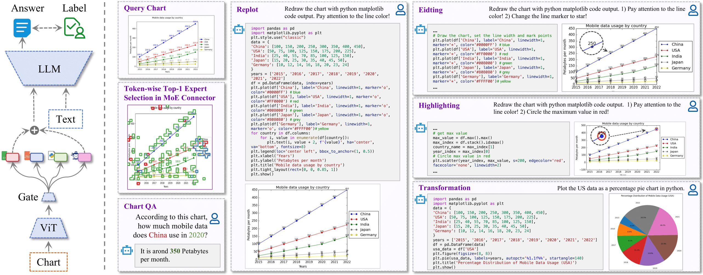
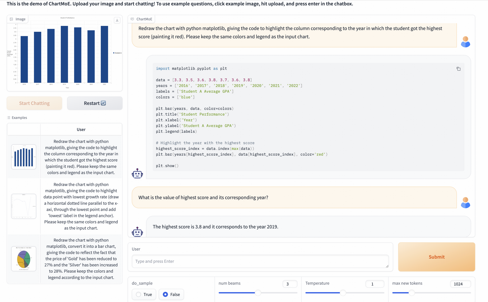

# ChartMoE: Mixture of Expert Connector for Advanced Chart Understanding
<div align="center">

[](https://arxiv.org/abs/2409.03277)
[](https://chartmoe.github.io/)
[](https://huggingface.co/IDEA-FinAI/chartmoe)

</div>



**ChartMoE** is a multimodal large language model with Mixture-of-Expert connector for advanced chart 1)understanding, 2)replot, 3)editing, 4)highlighting and 5)transformation. 

## News

- 2024.9.10: We release ChartMoE!

## Training Pipeline of ChartMoE


## Installation
**Step 1.** Create a conda environment and activate it.

```bash
conda create -n chartmoe_env python=3.9
conda activate chartmoe_env
```

**Step 2.** Install PyTorch (We use PyTorch 2.1.0 / CUDA 12.1)

```bash
pip install torch==2.1.0 torchvision==0.16.0 torchaudio==2.1.0 --index-url https://download.pytorch.org/whl/cu121
```

**Step 3.** Install require packages

```bash
pip install -r requirements.txt
```

**Step 4.** Install editable ChartMoE packages

```bash
pip install -e .
```

## Quick Start
**Customize the weight path of ChartMoE:**
Set your own [ChartMoE_HF_PATH](https://github.com/Coobiw/ChartMoE/tree/master/chartmoe/utils/custom_path.py#L2).

Code Demo:

```python
from chartmoe import ChartMoE_Robot
import torch

robot = ChartMoE_Robot()
image_path = "examples/bar2.png"
question = "Redraw the chart with python matplotlib, giving the code to highlight the column corresponding to the year in which the student got the highest score (painting it red). Please keep the same colors and legend as the input chart."

history = ""
with torch.cuda.amp.autocast():
    response, history = robot.chat(image_path, question, history=history)

print(response)
```

## Evaluation

### ChartQA
**Customize the path of ChartQA:**
Set your own [ChartQA_ROOT](https://github.com/Coobiw/ChartMoE/tree/master/chartmoe/utils/custom_path.py#L5)(including `test_human.json` and `test_augmented.json`) and [ChartQA_TEST_IMG_ROOT](https://github.com/Coobiw/ChartMoE/tree/master/chartmoe/utils/custom_path.py#L6)(including the test images).

**w/ PoT:**
```bash
CUDA_VISIBLE_DEVICES=0 python chartmoe/eval_ChartQA.py --save_path ./results/chartqa_results_pot --pot
```

**w/o PoT:**
```bash
CUDA_VISIBLE_DEVICES=0 python chartmoe/eval_ChartQA.py --save_path ./results/chartqa_results
```

### MME
Run `chartmoe/eval_MME.ipynb` for MME scores.

## WebUI Demo

```bash
CUDA_VISIBLE_DEVICES=0 python gradio_demo.py 
```



## Acknowledgement
Thanks to [InternLM-XComposer2](https://github.com/InternLM/InternLM-XComposer/tree/main/InternLM-XComposer-2.0) and [CuMo](https://github.com/SHI-Labs/CuMo) for their releases of model weights and source codes! And thanks to [MMC](https://github.com/FuxiaoLiu/MMC) and [ChartGemma](https://github.com/vis-nlp/ChartGemma) for their releases of the high-quality instruction-tuning data!

## Citation
If you find our idea or code inspiring, please cite our paper:
```bibtex
@article{ChartMoE,
    title={ChartMoE: Mixture of Expert Connector for Advanced Chart Understanding},
    author={Zhengzhuo Xu and Bowen Qu and Yiyan Qi and Sinan Du and Chengjin Xu and Chun Yuan and Jian Guo},
    journal={ArXiv},
    year={2024},
    volume={abs/2409.03277},
}
```
This code is partially based on [ChartBench](https://chartbench.github.io/), if you use our code, please also cite：
```bibtex
@article{ChartBench,
    title={ChartBench: A Benchmark for Complex Visual Reasoning in Charts},
    author={Zhengzhuo Xu and Sinan Du and Yiyan Qi and Chengjin Xu and Chun Yuan and Jian Guo},
    journal={ArXiv},
    year={2023},
    volume={abs/2312.15915},
}
```